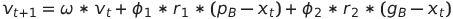

# Algoritmo Otimização por Enxame de Partículas

## Como executar o código
  Abrir o terminal e ir até a pasta onde está o código.
  Depois, é só executar com:

  ```sh
    python3 main.py
  ```

  Os resultados finais estarão na pasta ```results/```, uma série de arquivos ```.csv``` com o resultado de cada teste, para 20, 50 e 100 iterações e população com 50 e 100 indivíduos. Cada resultado estará nomeado de acordo com a quantidade de iterações e o tamanho da população que rodou ```{I}it-{P}pop-10.csv```. 

  Os arquivos foram persistidos em ```.csv``` para facilitar na plotagem dos gráficos, na hora de fazer o relatório. O gráfico de para cada tabela está na pasta ```images/```, junto com os resultados para aqueles gráficos. Cada gráfico tem uma nomeação ```{I}-{P}.png``` para cada ```I``` iteração e  ```P``` tamanho de população.


## Sobre o Algoritmo Otimização por Enxame de Partículas
  O Algoritmo Otimização por Enxame de Partículas (Particle Swarm Optimization - PSO), assim como o Algoritmo Genético, foi inspirado na natureza. Proposto por James Kennedy e Russel Eberhart em 1995, esse algoritmo se baseia no comportamento social dos pássaros. 

  Em um dado espaço de busca, esse algoritmo tem o objetivo de encontrar uma solução ótima, através da troca de informações entre indivíduos de uma população, determinando assim qual trajetória cada um deles deverá tomar no espaço de busca e buscando qual a mais adequada.

### Observação: 

  O professor determinou que: "A escolha dos parâmetros do algoritmo evolutivo (setup) faz parte do trabalho".

  Esses parâmetros são referentes às constantes utilizadas pela equação para atualizar a velocidade da partícula:

  

  Segundo [1], bons valores a serem escolhidos são: ```Q1``` e ```Q2``` iguais a ```2.05``` e ```W``` igual a ```0.5```, mas nada impede de tentar outros. Nesse trabalho foram seguidos esses valores mesmo.

## Resumo do código desenvolvido
  - Cada arquivo é uma classe que representa uma parte do algoritmo;

  - O ```particle.py``` representa as partículas, e contam com as coordenadas atuais, as melhores coordenadas, a velocidade das coordenadas da partícula e a aptidão, além de funções para trazer e encontrar esses valores a serem utilizados pelas outras classes;

  - O ```population.py``` gera a população inicial para o PSO, retornando a lista de população com posições aleatórias mas uma velocidade inicial igual para as partículas;

  - O ```pso.py``` é o arquivo que contém a classe que realmente executa o algoritmo genético. Seu método principal é o ```execute```, que irá pegar a população inicial gerada, rodar a função de aptidão para cada partícula e ordená-las e uma lista, a fim de pegar a partícula com a melhor aptidão (```gB```). Cada partícula tem então sua velucidade e posição atualizada. esse processo se repete a cada ```iterations```, passada como parametro na main;

  - O ```main.py``` gerencia para que o algoritmo genético ocorra para 20, 50 e 100 iterações e população com 50 e 100 indivíduos, e chama o auxiliar ```test2csv``` para salvar os resultados nos arquivos ```.csv``` para relatório.

## Referências 

[1]: Eberhart, R. C. and Kennedy, J. (1995). A new optimizer using particle swarm theory. In Proceedings of the sixth international symposium on micro machine and human science, volume 1, pages 39–43. New York, NY.
